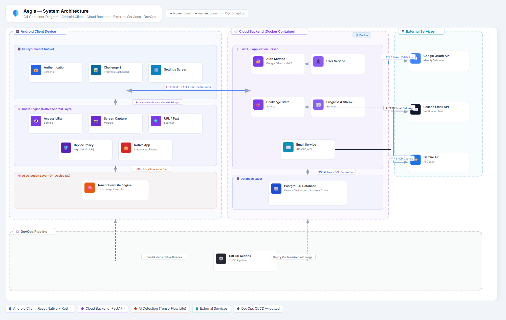
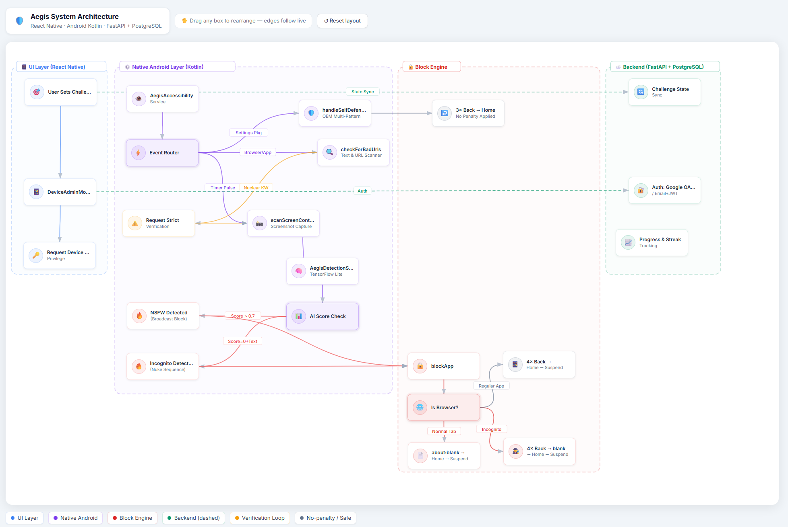
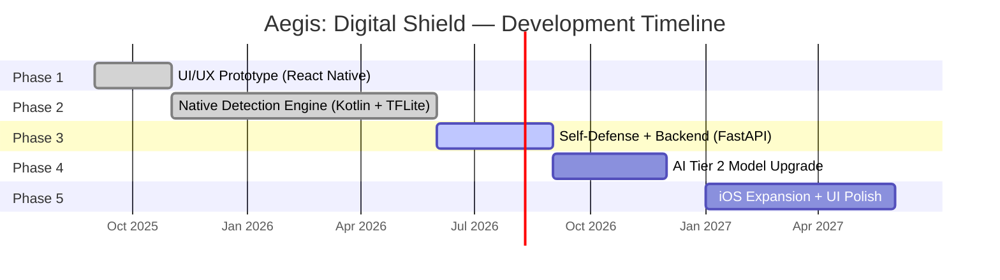

# 🛡️ Aegis: Digital Shield
### *An intelligent, AI-powered Android accountability app — built to help users break free from porn addiction.*

  
  
  
  
  
  

> ⚠️ **Note:** The full source code is maintained in a **private repository**. This showcase repository documents the architecture, engineering decisions, and development lifecycle for portfolio purposes. Contact details are at the bottom.

---

## 📖 Table of Contents
* [📌 Project Overview](#-project-overview)
* [🧠 Context & Motivation](#-context--motivation)
* [🎯 What Problem It Solves](#-what-problem-it-solves)
* [💡 The Solution](#-the-solution)
* [📱 App UI Showcase](#-app-ui-showcase)
* [🏗️ System Architecture](#%EF%B8%8F-system-architecture)
* [🔄 Application Workflow](#-application-workflow)
* [🧠 What I Learned](#-what-i-learned)
* [⚙️ Technical Highlights](#%EF%B8%8F-technical-highlights)
* [🧪 Testing & TDD Strategy](#-testing--tdd-strategy)
* [🔄 SDLC — Development Lifecycle](#-sdlc--development-lifecycle)
* [📊 Commit Highlights](#-commit-highlights)
* [🛠️ Tech Stack](#%EF%B8%8F-tech-stack)
* [📁 Repository & Project Board Structure](#-repository--project-board-structure)
* [👤 About the Developer](#-about-the-developer)

---

## 📌 Project Overview

Aegis: Digital Shield is a **high-commitment Android accountability application** built for users who want real, inescapable control over their digital habits. Unlike simple blocklists or browser filters that can be disabled in seconds, Aegis is designed to be **resilient by architecture** — it fights back.

### The Three Core Pillars

| Pillar | Description |
|---|---|
| 🔍 **Detect** | Real-time on-device AI scanning + text analysis to identify NSFW content across any app |
| 🔒 **Lock** | Suspends the offending app immediately and forces the user to the home screen |
| 🛡️ **Persist** | Prevents uninstallation, disabling, or bypassing during an active accountability challenge |

---

## 🧠 Context & Motivation

Aegis: Digital Shield began as a personal engineering challenge to solve a major loophole in digital habit control. Most existing accountability and blocking systems are incredibly easy to bypass—a user can simply disable a browser extension, toggle off an accessibility permission, clear data, or uninstall the app during a moment of vulnerability. 

Aegis was built with a different philosophy: it is **resilient by architecture** and designed to "fight back." It integrates deep Android system permissions and custom on-device intelligence to enforce a high-commitment challenge period that cannot be bypassed or uninstalled once active.

---

## 🎯 What Problem It Solves

Users attempting to reduce compulsive NSFW consumption often struggle during short vulnerability windows where immediate intervention and behavioural support are critical. 

Existing blocker solutions frequently focus only on basic web domain filtering without addressing user behavior, app usage, emotional guidance, privacy, or proactive awareness. Aegis addresses this by:
* **Providing real-time behavioral support** during the exact window of vulnerability.
* **Respecting user privacy** by handling screen classification locally on-device.
* **Eliminating easy bypass options** through a secure, self-defending native Android engine.

---

## 💡 The Solution

Aegis combines a **React Native frontend UI** with a **Kotlin native Android engine** to build a privacy-first behavioral intervention platform:
* **On-Device Machine Learning:** Running low-latency image classification directly on the device using TensorFlow Lite, removing the need to transmit screenshots to the cloud.
* **Deep OS Level Integration:** Using Android's accessibility tree and administrative permissions to detect and intercept bypass settings screens across multiple OEM implementations.
* **High-Commitment Lockdowns:** Instantly suspending offending applications and triggering inescapable overlays when triggers are detected, breaking the loop of compulsive consumption.

---

## 📱 App UI Showcase
> A visual preview of the Aegis React Native interfaces (Onboarding, Active Dashboard, and the Inescapable Lockdown interface).

| Onboarding & Login | Challenge Status Dashboard | Inescapable Lockdown Countdown |
|:---:|:---:|:---:|
| `[Place Login Mockup Here]`   *High-fidelity UI showing uninstall warning notifications.* | `[Place Dashboard Mockup Here]`   *Dynamic challenge tracking with custom duration selector.* | `[Place Lockdown Preview Here]`   *High-fidelity simulation of the inescapable overlay.* |

---

## 🏗️ System Architecture

The Aegis system architecture represents a hybrid client-server model. The client-side Android layer performs real-time, low-latency, privacy-safe content analysis, while the backend coordinates configuration, user stats, and accountability features.

### High-Level System Architecture Diagram
The following diagram highlights the system boundaries, containerized environments, database storage, external API dependencies, and the DevOps pipeline:

  

---

## 🔄 Application Workflow

The following flowchart visualizes the dynamic, real-time runtime logic of the Aegis client-side blocking engine. It details the interaction loop between node scanning, screen captures, TensorFlow Lite AI processing, Settings bypass intercepting, and the incognito nuke sequence:

  

---

## 🧠 What I Learned

Transitioning Aegis from a local prototype to a secure, production-ready system taught me critical lessons about mobile architecture, API design, security, and integration:

* **Token Storage & Security:** Understood the risks of storing short-lived access tokens on disk. Designed a hybrid storage system: caching the long-lived refresh token in the secure hardware storage (Keychain/Keystore) while holding the access token in active device memory.
* **Production Auth Flow UX:** Moved from an amateur registration auto-login to a multi-stage, recruiter-grade authentication stack (Landing $\rightarrow$ Sign-Up $\rightarrow$ Verification $\rightarrow$ Sign-In). Handled React Native navigation states to persist user data (like email autofill) during backward navigation.
* **On-Device AI vs. Cloud Latency:** Experimented with TensorFlow Lite local inference, learning how to partition mobile screen real-estate (8-region multi-crop) to balance detection speed, model footprint, and user privacy.
* **Third-Party Integrations (Resend vs. SMTP/Formspree):** Evaluated communication paths for transactional emails. Learned the difference between a form handler (Formspree) and a dedicated email delivery API (Resend), choosing API-driven delivery to reduce transport configuration overhead.
* **Database Security (Credential Hashing):** Implemented verification code hashing inside the PostgreSQL database using FastAPI. Storing hashes instead of plaintext prevents credential theft if the database is compromised.
* **Gradle Configuration & Environment Sharing:** Solved the environment variables discrepancy between Python and React Native by building a shared `.env` structure accessed by Android Gradle relative paths via `react-native-config`.

---

## ⚙️ Technical Highlights

### 🧠 1. On-Device AI — TensorFlow Lite Multi-Crop Scanner
Rather than sending screenshots to a cloud server (a major privacy concern), Aegis runs a **TensorFlow Lite model entirely on the device**.

To maximize detection accuracy, it doesn't just analyze the full screen — it slices the screenshot into **8 distinct regions**:

| Region | Purpose |
|---|---|
| Full Screen | Overall context |
| Center Square | Primary content area |
| Top Half | Header/banner images |
| Bottom Half | Footer thumbnails |
| Top-Left Quadrant | Grid image detection |
| Top-Right Quadrant | Grid image detection |
| Bottom-Left Quadrant | Grid image detection |
| Bottom-Right Quadrant | Grid image detection |

**Why 8 regions?** A single thumbnail of explicit content in a corner would score low on a full-screen analysis. Multi-crop ensures nothing hides in the edges.

---

### 🕵️ 2. The Incognito Nuke Sequence
A key engineering challenge: Android's `FLAG_SECURE` blocks screenshots in Incognito tabs, returning a completely **pitch-black image** — which normally scores `0.0000` (safe!) on the AI model.

**The solution — a 3-step synergy:**
1. **Pure Black Pixel Check:** The Accessibility Service checks 5 pixels (4 corners + center). If all are `#000000`, it sets `isCurrentlyIncognito = true`.
2. **AI + Text Synergy:** If the AI scores `0.0000` **AND** the Text Scanner found a nuclear keyword (e.g. a known NSFW brand name), Aegis concludes: *"Incognito Porn Session Detected."*
3. **The Nuke:** 4 rapid Back taps (destroys incognito history) → `about:blank` injection → Home → App Suspend.

---

### 🛡️ 3. Aegis Self-Defense (OEM Multi-Pattern Matching)
A determined user might try to disable Aegis by navigating to Settings. The Self-Defense system intercepts this at the OS level.

**The challenge:** Android OEMs use different class names for the same settings screens. For example:
- Stock Android: `InstalledAppDetails`
- Samsung One UI: `ApplicationsDetailsActivity`
- Xiaomi MIUI: `ApplicationsDetailsActivity` (different package)
- OnePlus: `AppDetailFragment`

**The solution:** A two-layer detection system:
- **Layer 1 (Fast):** Match against a set of 13 known class name patterns across 7 OEM skins.
- **Layer 2 (Fallback):** Scan the visible node tree for the text `"AegisApp"` — works on any unknown OEM.

When triggered: **3× Back → Home** (no app penalty, just a silent redirect).

---

### 🏃 4. Race Condition Prevention
When an NSFW page is detected, three independent systems may trigger simultaneously:
- The JavaScript layer (URL pattern matching)
- The Native AI (image score)
- The Text Scanner (nuclear keyword match)

Without protection, this caused Chrome to open **3–4 redundant `about:blank` tabs**. The fix: an `isAlreadyBlocked` flag checked atomically before any block sequence executes. Only the **first** trigger wins; all others are silently discarded.

---

## 🧪 Testing & TDD Strategy
To ensure absolute reliability and maintain high standards of code quality, Aegis implements a multi-layered testing strategy across both its frontend and backend components:

* **Backend Unit & Integration Testing (Pytest):** Following Test-Driven Development (TDD) principles, we write assertions first to verify password hashing, token validation rules, challenge state logic, and API routes before writing implementation endpoints.
* **Frontend Unit Testing (Jest & React Native Testing Library):** Focuses on isolating and testing asynchronous storage helpers, custom hooks, and utility components.
* **System & Device Verification (Manual/Logcat):** End-to-end user flows (such as Accessibility Service node capturing and TensorFlow Lite classification) are systematically validated using specialized device scripts and real-time Android logcat analysis.

---

## 🔄 SDLC — Development Lifecycle

This project follows an **Iterative & Incremental** SDLC model. Each phase delivers a fully working, testable increment that builds on the previous one.

### Why Iterative & Incremental?
Early in the project, the full technical requirements were unknown. For example:
- The original plan was a **VPN-based network interceptor** → discovered during Phase 2 implementation that the Accessibility Service approach was faster, more reliable, and didn't require root.
- The original lockdown used a **full-screen overlay** → testing revealed Android restrictions, so we pivoted to **app suspension**.
- **Incognito tab vulnerabilities** were only discovered during real-world testing of Phase 2.

Each discovery fed directly into the next iteration. A rigid Waterfall approach would have required scrapping and restarting multiple times.

---

## 📊 Commit Highlights

| Commit | Phase | Description |
|---|---|---|
| `5551ed9` | Phase 1 | Initial README and project documentation |
| `7c9163a` | Phase 1 | UI/UX prototype — screens, modals, and navigation |
| `65a810c` | Phase 2 | Device Admin privilege request and Accessibility Service setup |
| `7e1b53f` | Phase 2 | TFLite screen capture algorithm and multi-crop detection design |
| `cc30df4` | Phase 2 | Major: Fixed detection logic, Incognito Nuke Sequence, race condition fix, dynamic browser tracking |
| `c65a867` | Phase 2 | `.gitignore` hardening for native build artifacts |
| `6afbda2` | Phase 3 | README rewrite to reflect actual Phase 2 architecture |
| `3388340` | Phase 3 | Phase 3: OEM-aware Self-Defense settings interceptor + removed `lockNow()` vulnerability |

> 📁 Full commit history is available in the private repository. Contact me for access.

---

## 🛠️ Tech Stack

| Layer | Technology | Why |
|---|---|---|
| UI Framework | React Native (CLI) | Cross-platform foundation with direct native module bridge |
| Native Layer | Kotlin (Android) | Required for Accessibility Service, Device Admin, and TFLite integration |
| AI/ML | TensorFlow Lite | On-device inference — no cloud, no privacy risk |
| Backend API | FastAPI (Python) | High-performance async REST API for auth and data sync |
| Database | PostgreSQL | Robust relational schema for user progress and challenge state |
| Auth | Google OAuth + JWT | Flexible dual-auth with token-based session verification |
| Version Control | Git + GitHub | Branch-per-phase strategy with linked GitHub Project Boards |

---

## 📁 Repository & Project Board Structure

The private repository is organized with dedicated branches and GitHub Project Boards per phase:

| Branch | Project Board | Status |
|---|---|---|
| `phase1` | Phase 1: UI Prototype | ✅ Closed |
| `phase2` | Phase 2: Lock Down Algorithm | ✅ Closed |
| `phase3` | Phase 3: Aegis Self-Defense & Zero Tolerance | 🚧 Open |

---

## 👤 About the Developer

**Yahya ZE Salman**  
Back-End Developer | AI/ML Developer | Cyber Security Seeker

This project represents a full-stack, cross-discipline engineering challenge — combining mobile UI, native Android development, on-device machine learning, REST API design, and security hardening into a single production-grade application.

📬 **Interested in the full source code or a deeper walkthrough?**  
Reach out via GitHub: [@yzes95](https://github.com/yzes95)

---

🛡️ Aegis: Digital Shield — Built with purpose.

